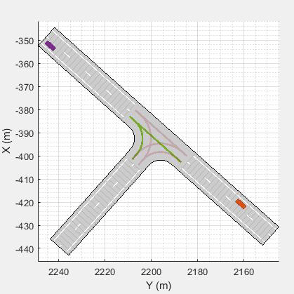
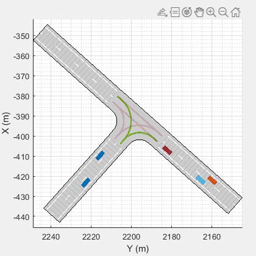
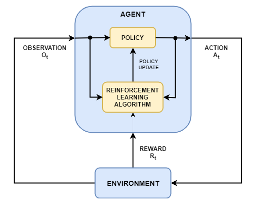
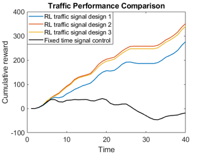

# Agent-based Traffic Signal Management System by Model-free Reinforcement Learning

- Author: Xiangxue(Sherry) Zhao 
- Email: xiangxuezhao@gmail.com 

## Overview
Traffic congestion is always a daunting problem that affects people's daily life across the world. The objective of this work is to develop an intelligent traffic signal management to improve traffic performance, including alleviating traffic congestion, reducing waiting times, improving the throughput of a road network, and so on. Traditionally, traffic signal control typically formulates signal timing as an optimization problem. In this work, reinforcement learning (RL) techniques have been investigated to tackle traffic signal control problems through trial-and-error interaction with the environment. Comparing with traditional approaches, RL techniques relax the assumption about the traffic and do not necessitate creating a traffic model. Instead, it is a more human-based approach that can learn through trial-and-error search. The results from this work demonstrate the convergence and generalization performance of the RL approach as well as a significant improvement in terms of less waiting time, higher speed, collision avoidance, and higher throughput.
## About
This repository provides detailed instructions on the design and implementation of the RL algorithm to solve the traffic signal control problem. It shows three different traffic signal designs, as well as the process of intelligent RL agent learns to manage the traffic light adapting to real-time traffic conditions. Meanwhile, the environment interface is devised that the user can specify their own traffic signal design and RL algorithms to test it on.

&nbsp;&nbsp;&nbsp;&nbsp;&nbsp;&nbsp;&nbsp;&nbsp;&nbsp;&nbsp;&nbsp;&nbsp;&nbsp;&nbsp;&nbsp;&nbsp;&nbsp;&nbsp;&nbsp;&nbsp;&nbsp;&nbsp;&nbsp;&nbsp;&nbsp;&nbsp;&nbsp;&nbsp;&nbsp;&nbsp;&nbsp;&nbsp;&nbsp;&nbsp;&nbsp;&nbsp;**Training Stage**

  

&nbsp;&nbsp;&nbsp;&nbsp;&nbsp;&nbsp;&nbsp;&nbsp;&nbsp;&nbsp;&nbsp;&nbsp;&nbsp;&nbsp;&nbsp;&nbsp;&nbsp;&nbsp;&nbsp;&nbsp;&nbsp;&nbsp;&nbsp;&nbsp;&nbsp;&nbsp;&nbsp;&nbsp;&nbsp;&nbsp;&nbsp;&nbsp;&nbsp;&nbsp;&nbsp;&nbsp;**Trained Agent**

## Getting Started
The introduction and detailed step-by-step instructions can be found from MATLAB Live Script: masterLiveScript.mlx **preferred**. Alternatively, you can also start with master.m, which is a MATLAB script **viewable on GitHub**.

The workflow of the developing process mainly involves five steps:

- Step 1: create an environment interface from MARTO specialized traffic simulator. For more information on the simulator, see [OpenTrafficLab](https://github.com/mathworks/OpenTrafficLab).
- Step 2: specify traffic problem formulation, including observation space, traffic signal phase design (action), and reward function. 
- Step 3: create deep Q-network (DQN) agent. A list of other agent options can be found [here](https://www.mathworks.com/help/reinforcement-learning/agents.html?s_tid=CRUX_lftnav).
- Step 4: specify the training options and train the agent.
- Step 5: validate the performance of the trained agent. 
## Dependencies
This model has been tested with MATLAB R2020b. The version tested with MATLAB R2020a is being developed. Here is a list of products required to run:
- [Reinforcement Learning Toolbox](https://www.mathworks.com/products/reinforcement-learning.html)TM
- [Automated Driving Toolbox](https://www.mathworks.com/products/automated-driving.html)TM
- [Parallel Computing Toolbox](https://www.mathworks.com/products/parallel-computing.html)TM

<!--  -->

